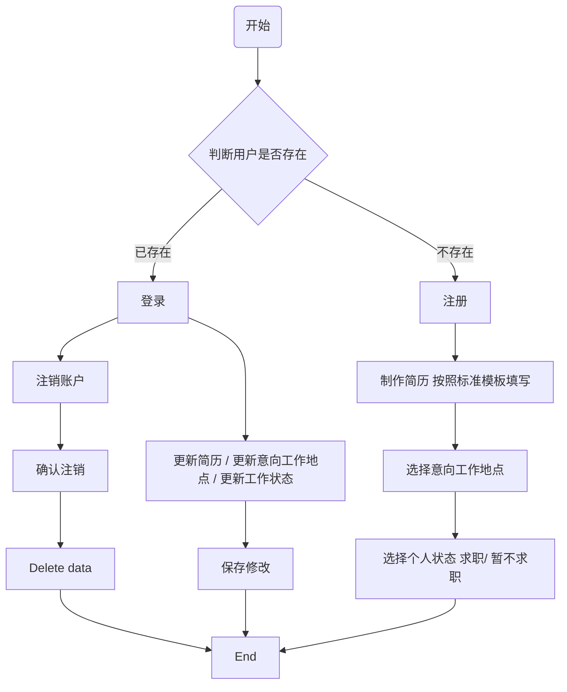
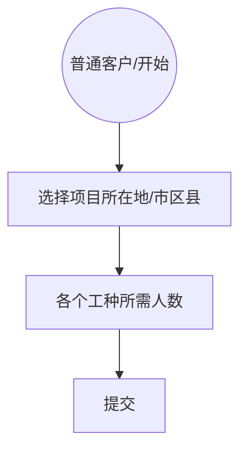
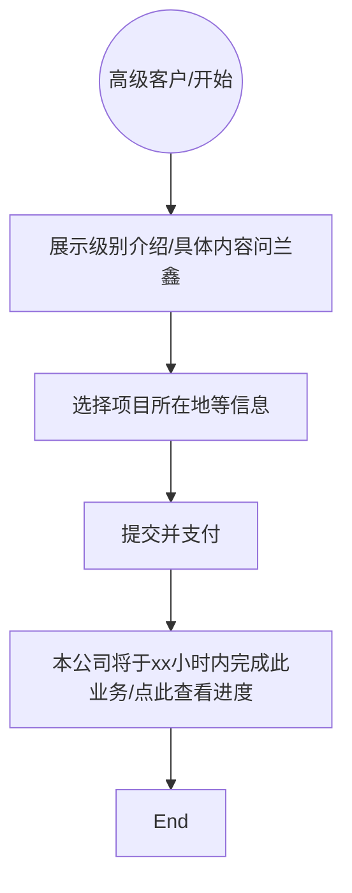
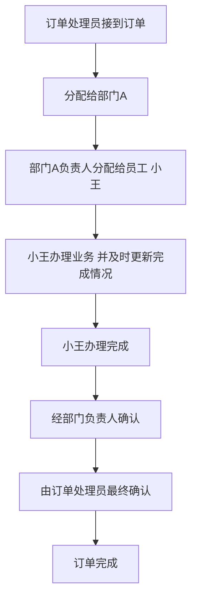

# Lan Xin's Dream

**He has a great dream**

对于数据的删除、更改，伪操作，保留原档

## 上传简历的小程序

**简历信息包括：**

- 姓名
- 电话
- 学历
- 工作经历
- 照片
- 证书
- 工种
- et.al  #  待兰鑫添加

## 客户端，面向企业

### Introduction

- 预充值，余额随时可退款

- 普通客户已购买的项目不可退款

- 定制化高级客户根据订单完成情况退款
    - 例如某订单，需要10位安全员，10位资料员，支付了1000元。完成情况是5位资料员和5位安全员，退款500元

- 顶栏显示余额

### step1 注册

邀请注册，不开放

- 企业名称 unique =True
- 手机号
- 地址  选择 市区县街道，输入门牌号
- 使用人的 部门，姓名，职务
- 自定义ID unique=True

### step2 登录

ID & 密码登录， 手机号找回密码，或联系客服重置

### Step3 登陆后可查看：

#### Page1—— 普通客户

- 提交之后，显示所有可选人员

    - 每人为一个条目预览，显示姓名、学历、专业、工作经验
    - 条目点击可显示详情，点击购买
    - 购买该条目后在预览页面和详情页面看到联系方式
    - 条目添加复选框，便于批量购买

#### Page2 -- 普通客户 资产及订单管理

- 查看账户余额

- 退款
- 充值
- 查看已购买的订单项目
- 交易记录
- 个人资料管理/密码/更新手机号

#### Page3——定制化高级客户

- 查看进度，eg:
    - 您的XX项目需要资料员6名，安全员7名，现已完成资料员3名，安全员4名

- 订单完成后，短信通知，并在登陆时首页提醒

#### Page4 定制化高级客户资产及订单管理

- 充值
- 余额
- 退款
- 个人资料管理
- 查看订单
    - 已完成订单显示详情
        - 订单记录详情
        - 完成情况
        - 是否有退款及退款详情
    - 进行中的订单显示进度

## 公司后台

**老板拥有所有权限，不再赘述**

- 订单处理
- 资源库展示、查找
- 资源库修改、添加
- 营业情况
- 注册客户信息

### Business1 订单处理

#### Introduction

- “订单完成” 需要经过业务员小王、部门负责人、和订单处理人员共同确认

- “更新进度” 仅需要业务员小王提交更新

- 进度达到100% 自动标记完成

- 进度未达到100% ，可以人工标记完成（针对任务太难无法完成的情况）

#### **权限：**

- 订单处理者有权分配订单给指定部门，查看进度，标记订单状态

- 接受订单的部门负责人可以分配给指定员工，查看进度，标记订单状态
- 负责本订单的业务员可以查看进度，更新进度，标记状态

### Business2 资源库查看、修改

- 业务办理员小王可以在库中查找、筛选

- 人力部门可以向库中添加、修改
    - 添加、修改时 需要保持格式一致

### Business3 营业情况

#### Introduction

查看业务情况统计

- 营收详情
    - xx公司，xx业务，xx订单，消费xx元
    - xx公司，xx业务，xx订单，退款xx元
    - 总共收到充值xx元
    - 总共退款xx元

- 按照日、周、月、年 统计
- 可查看指定日期、指定时段营收详情

#### 权限

财务部门

### 查看客户信息

#### Introduction

查看注册客户的信息

#### 权限

仅老板

