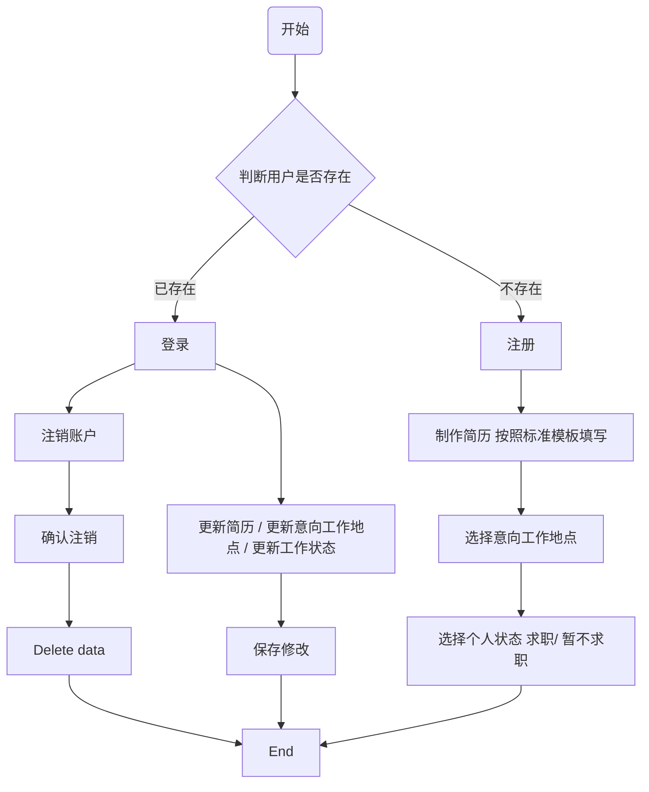

# ForLanXin

业务系统设计文稿

## 上传简历的小程序

**简历信息包括：**

- 姓名
- 电话
- 学历
- 工作经历
- 照片
- 证书
- 工种
- et.al  #  待兰鑫添加

## 客户端，面向企业
### step1 注册

邀请注册，不开放

- 企业名称 unique =True
- 手机号
- 地址  选择 市区县街道，输入门牌号
- 使用人的 部门，姓名，职务
- 自定义ID unique=True

### step2 登录

ID & 密码登录， 手机号找回密码，或联系客服重置

### Step3 登陆后可查看：

#### Page1—— 普通客户

- 选择项目所在地（市）

- 项目类型

- 各个专业工种所需人数  eg. 土建二人，安装5人

- 提交之后，显示所有可选人员

    - 每人为一个条目预览，显示姓名、学历、专业、工作经验

    - 条目点击可显示详情

    - 购买该条目后在预览页面和详情页面看到联系方式

#### Page2——定制化高级客户

- 展示级别介绍 （具体内容问兰鑫）
- 选择项目所在地等信息
- 本公司将于48h 内向您推送